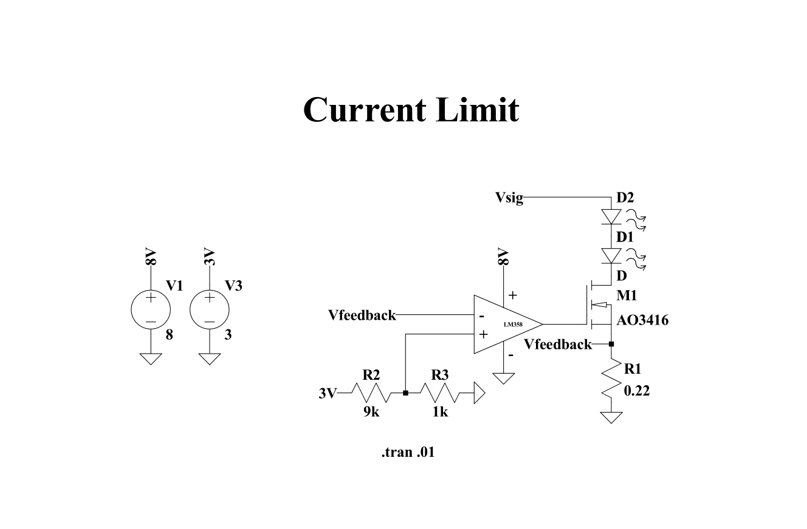

# Photon
Photon is a ecosystem that converts a grayscale video into a colorful video in real time. The reason why a grayscale or colorless video is captured is its nature to be captured in dark environment with no light sources using Infrared Cameras and Thermal Cameras. Infrared illumination is not as invasive as a high beam flash light that can cause irritation, disturbances and in some cases awareness to others which is addressed by Photon.

## Preview

<table align="center">
  <tr>
    <td align="center">
      <p><strong>Captured</strong></p>
      
    </td>
    <td align="center">
      <p><strong>Processed</strong></p>
      
    </td>
  </tr>
</table>

The processing of the grayscale video to make it colorful is done in real-time. The input resolution was limited to 256x256 pixels in order to reduce the latency and performance required to perform this alll computation in real time.

## [Hardware](./photon/hardware/)

The active illumination is done using Infrared LEDs which produce invisible infrared led that is captured by the Infrared Camera. There are two parts to properly powering such LEDs. Voltage regulator simply regulates a constant voltage and the current draw is dependent upon the load. Therefore to safely operate a diode which has exponential IV curve needs a current regulation given by following circuit.
<p align="center">
    
</p>

This current limiter was soldered and realized to illuminate our video captures. Similarly even the Infrared camera we used is simply a pi camera whose IR filter was removed by us.

<p align="center">
    
</p>

The video frames captured by the camera was transmitted to the processing computer with UDP protocol to ensure the lowest latency and responsiveness in the system. UDP ensures that even if the packet gets lost, the connection doesn't suffer.

  ```
  rpicam-vid -t 0 --width 640 --height 480 --framerate 30 --codec h264 --nopreview --inline --profile baseline --intra 15 --flush 1 -o udp://<IP Reciever>:<Port>?pkt_size=1316
  ```
This command was used to transfer the video frames in real time in low resolution to ensure that low bandwidth communication would suffice for real time communication.


